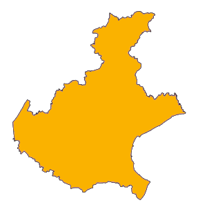
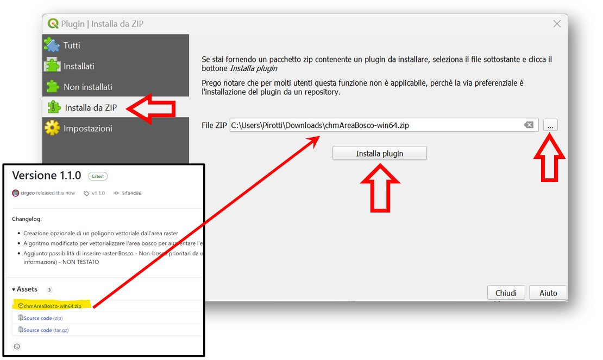
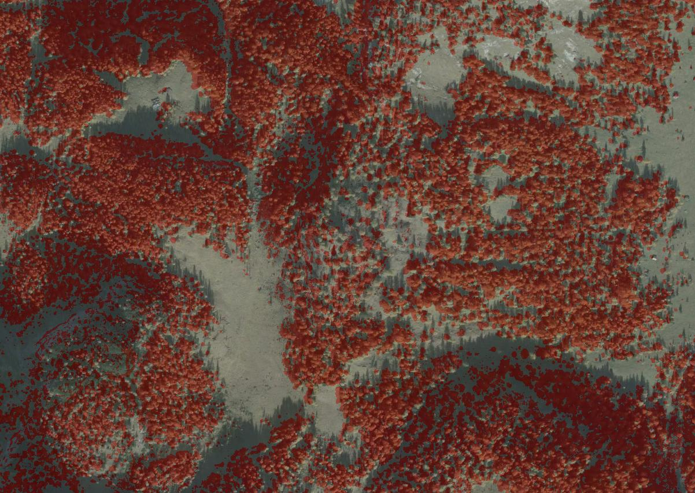

# Da CHM a Area Bosco

[Descrizione](#Descrizione) |
[INPUT](#Metodi) |
[Installazione](#Installazione) |
[Benchmark](#benchmark) |
[Esempio](#Esempio)  

## Descrizione  

Il plugin CHM => Bosco converte un livello raster con il modello delle 
chiome (CHM - Canopy Height Model) in un raster binario dove 0=non bosco 
e 1=bosco. Vengono utilizzati diversi parametri per definire 
le caratteristiche del bosco.

Il peso del plugin è circa 110 MB in quanto include la libreria 
grafica [OpenCV - *Open Source Computer Vision Library*](https://it.wikipedia.org/wiki/OpenCV) (109 MB)
che consente elaborazioni ottimizzate su immagini raster.

## Metodi

### Input 

 - **Input CHM** - Un livello raster contenente il CHM ovvero un modello delle chiome. 
Questo raster deve necessariamente essere accurato, 
in quanto fornisce l'informazione di base per la 
creazione dell'area a bosco.
 - **Input Maschera Pixel Bosco** - [Un raster binario BOSCO*](#mask) (pixel con valore 1 = pixel bosco) \[opzionale\]: 
il valore 1 del pixel di questo raster verrà considerato bosco a prescindere 
dal risultato del plugin, ovvero questa informazione avrà priorità
nella definizione bosco. [vedi schema in immagine 1](#mask)
 -  **Input Maschera Pixel Non Bosco**  - [Un raster binario NON BOSCO*](#mask) (pixel con valore 1 = pixel NON bosco) \[opzionale\]: 
il valore 1 del pixel di questo raster verrà considerato non bosco a prescindere 
dal risultato del plugin, ovvero questa informazione avrà priorità
nella definizione di aree da escludere dall'area bosco. [vedi schema in immagine 1](#mask)
- **Soglia altezza chioma (m)** - l'altezza della chioma minima per definire il pixel
come appartenente ad un albero.
- **Densità copertura (%)** - La proporzione minima coperta da chioma perchè l'area venga inclusa
come bosco.
- **Area minima (m2)** - L'area minima per definire un'area a bosco.
- **Larghezza minima (m)** - L'area minima per definire un'area a bosco.

### Output
 
Gli output sotto sono entrambi opzionali - nel senso che si possono creare entrambi, uno
di essi o nessuno dei due. Il raster viene creato in maniera predefinita, 
mentre il vettoriale no, deve essere l'utente che sceglie di crearlo. Entrambi possono
essere creati come file temporanei o meno.

- **Area Bosco Raster** - \[opzionale\] - Il raster con l'area a bosco.
- **Area Bosco Vettoriale** - \[opzionale\] - Il file vettoriale delle aree a bosco, 
tematizzato e con una colonna "area_ha" con  l'area in ettari.

## Installazione  

Scaricare il file compresso "chmAreaBosco-xxxx.zip" dell'ultima versione
[al link GITHUB](https://github.com/cirgeo/chmAreaBosco/releases) dove 
xxx indica il sistema operativo

Andare sul menù QGIS "Plugins"=>"Gestisci ed Installa Plugins" e selezionare 
"Installa da ZIP" nella parte sinistra della finestra ed il file compresso scaricato.
Premere il pulsante "installa" ed aspettare la fine dell'installazione.

## Benchmark

Three CHM rasters with the following size have been tested. All CHMs 
have 0.5 m resolution - time for processing using a normal laptop with 8 MB RAM 
and a i7 processor 3 GHz is reported.
is reported  
- X: 3845 Y: 2838 - (50 MB)  - 2 secondi
- X: 4506 Y: 5770 - (180 MB) - 13 secondi
- X: 27413 Y: 19240 (4.6 GB)-

NB - la velocità dipende molto dalla complessità della struttura 
orizzontale del CHM ovvero dal rapporto spazi senza chiome e spazi con chiome.
A parità di dimensione del raster CHM, un'area completamente coperta da chiome o 
completamente scoperta da vegetazione avrà tempi di elaborazione molto più veloci 
rispetto ad un'area con una struttura più a "scacchiera" ovvero alternanza di aree con 
e senza vegetazione. Questo perchè l'elaborazione lavora sui margini e non sulle parti interne.

## Esempio

Scaricare il file chm.tif che trovate [QUI](extra/example/chm.tif) ed aggiungerlo 
al progetto QGIS - tematizzatelo come preferite:

Aprite il plugin e selezionate il chm e avviate l'elaborazione.
Il CHM verrà convertito internamente ad un file binario

E le aree a bosco identificate e accorpate nel raster in output. La aree 
con estensione sotto soglia vengono eliminate (Vedi differenza tra l'immagini seguenti 
sopra e sotto )

< img src="extra/example/risultatoNoCleanAreePiccoleNoBosco.jpg" width=300 >
< img src="extra/example/risultatoCleanAreePiccoleNoBosco.jpg" width=300 > 

Se l'utente vuole esportare anche il file vettoriale con le aree, questo deve esssere espressamente
definito nel pannello delle impostazioni [vedi sezione ouput](#output)

        * Attenzione - i due raster binari Bosco e Non Bosco devono avere
        valori zero (0) per i pixel non appartenenti alla cateogria, 
        e un numero diverso da zero (preferibilmente 1) per i pixel 
        appartenenti alla categoria. Ad esempio si può ottenere un raster 
        "Non Bosco" da poligoni che rappresentano le aree urbanizzate 
        facendo la conversione da formato vettoriale a raster 
        (mediante il comando nel menù raster==>Conversione==>Rasterizza)
        
**NB:** nel caso di utilizzo di entrambi i raster "binari", in caso di 
valori in conflitto ovvero discordanti, viene data priorità al raster non-bosco
[vedi schema in immagine 1](#immagine_1)

