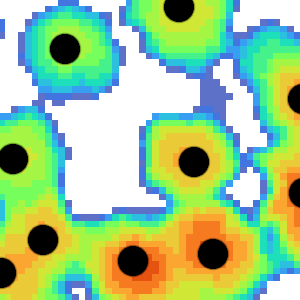

# Tree Detection

   

## Description  

The plugin process *CHM => Single Tree Detection* applies latest methods to detect tree 
top position. 
 
It is optimized for speed with a simple initial procedure that seeds
using local maxima with a small kernel, and then removes false positives with 
successive iterations. The rationale is simply that a small kernel is much faster 
than a large or adaptive kernel, and can therefore be applied to all the raster grid.
Only after having all local maxima, larger kernels can be applied only to local maxima 
positions, thus not all the raster. 

A likelyhood index can optionally be added to address how close the local
maxima kernel matches
